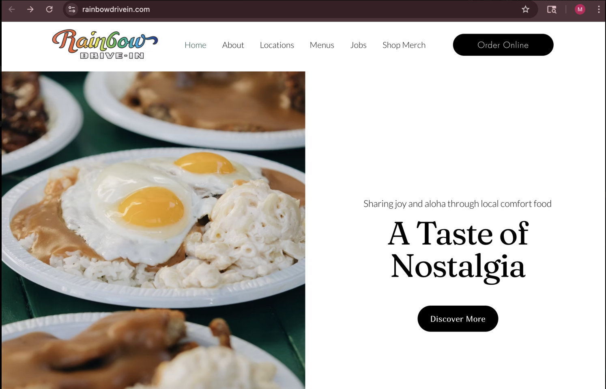
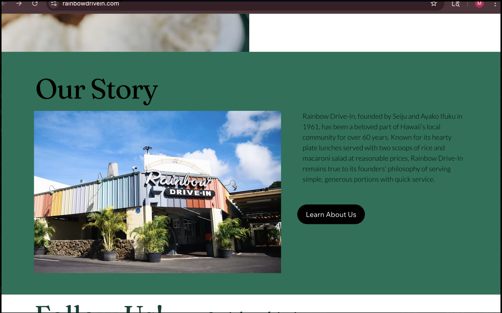
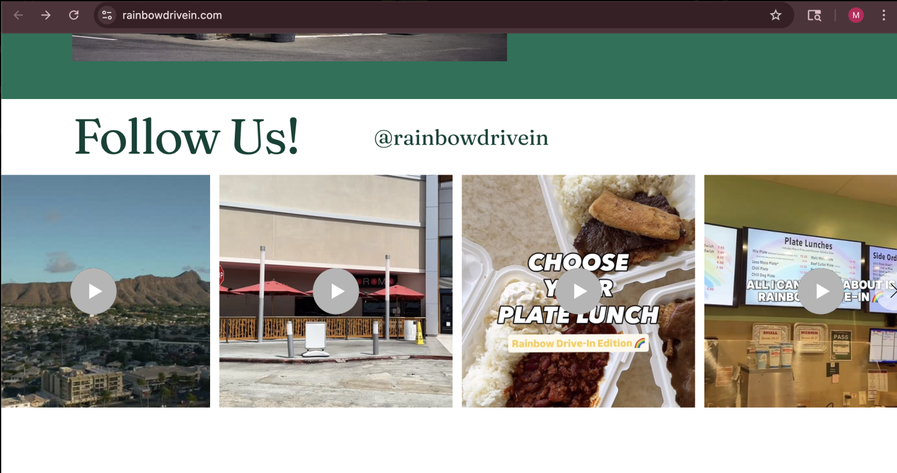
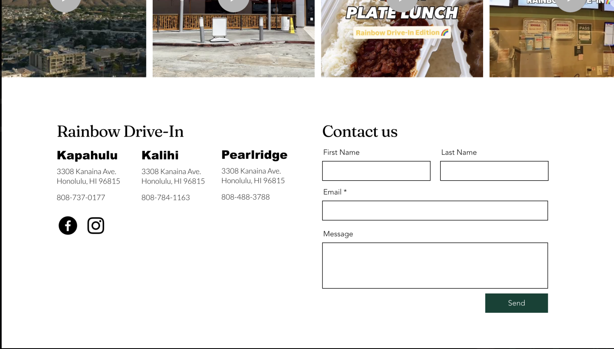
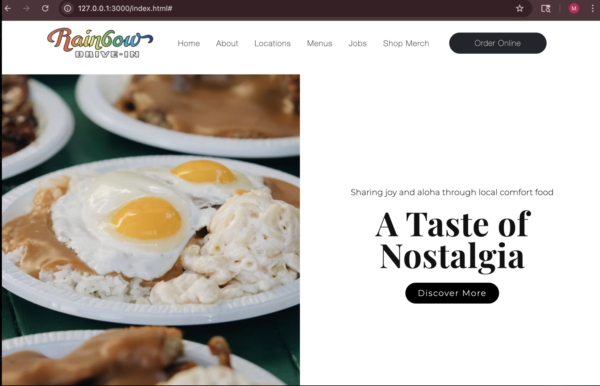
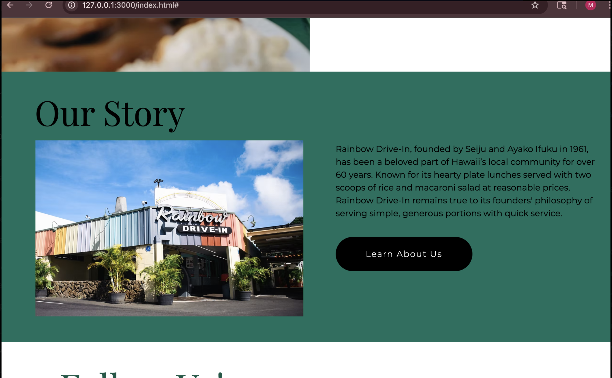
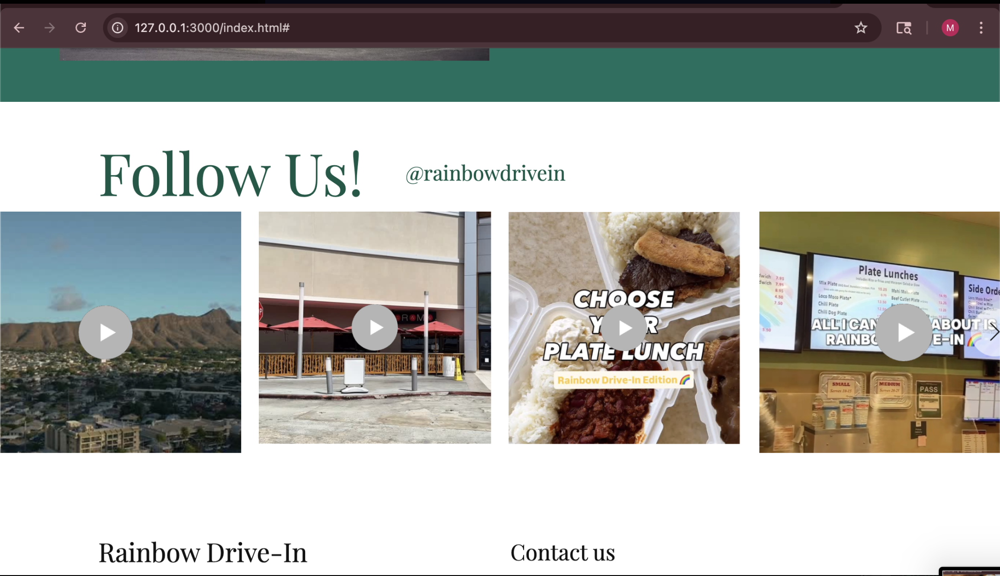
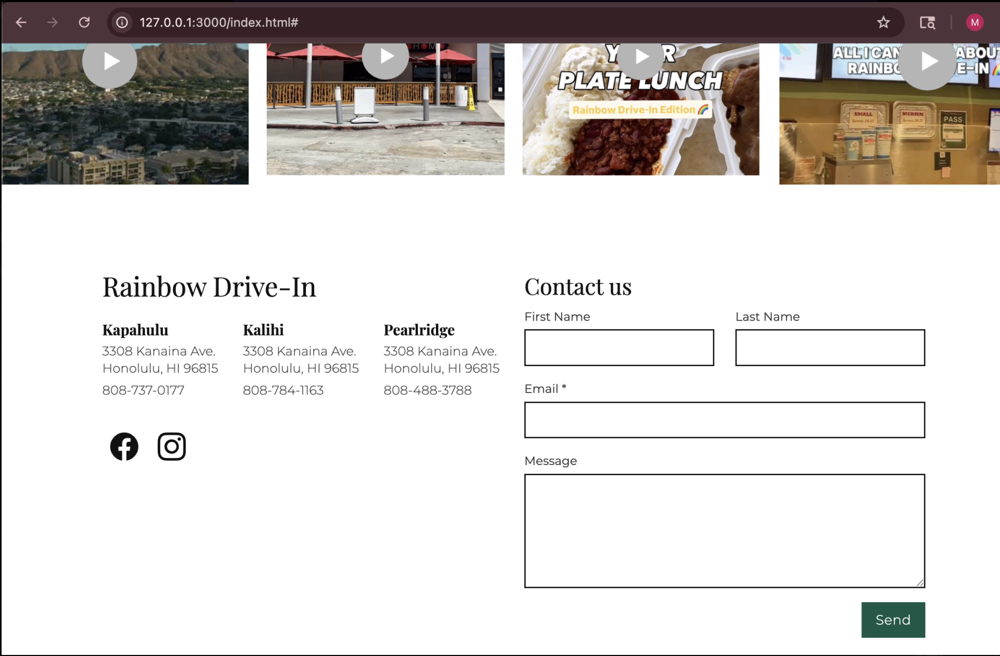

Every now and then, as I wrestle with Bootstrap 5, I catch myself thinking back to a time when I had no clue of its existence. And honestly I let out a little sigh for those simpler days. UI frameworks offer web developers a collection of pre-built tools that streamline the creation of user interfaces. A major downside is that the wide range of tools can be overwhelming and tough to adjust to. Although they can be frustrating to learn, UI frameworks such as Bootstrap, Semantic UI, and Tailwind CSS make building websites faster, more consistent and better suited across devices. 

## The Challenge of Raw HTML and CSS

Before UI frameworks were in the picture, websites were built manually with raw HTML and CSS code. The benefits to this were that they had full control over the design aspects which gave them lots of flexibility and opportunities for precision. However issues arose when they had to ensure consistency across multiple platforms, such as devices. Making the websites look the same on different screen sizes and browsers took a lot of time and effort. On larger scale projects using raw HTML and CSS becomes inefficient. The amount of time it takes to design and style every button, navigation bar and grid adds up. And considering the efforts that go into testing its compatibility across browsers and devices, it only increases the time spent on web development exponentially. So while this approach does allow more freedom for design and opportunity for precision, it takes a lot of extra manual work which is the reason why UI frameworks have become so popular. 

## What UI Frameworks Offer

UI frameworks offer a faster and more organized way to build websites. Given pre-built components like buttons and navigation bars, there is no need to have to create these objects from scratch. With ready-to-use elements, websites can come together smoothly, looking polished and put together. Additionally UI frameworks like Bootstrap, Semantic UI, and Tailwind CSS include a responsive design. These built-in grid systems and breakpoints automatically do the work to adjust website layouts for different devices and ensure consistency of colors, typography and spacing across all pages. Beyond visuals, UI frameworks help with cross-browser compatibility and accessibility, which reduces the number of bugs developers must fix manually. 

## Personal Experience with Bootstrap 5 

For one of my projects, I recreated the home page of the restaurant Rainbow Drive In. Using Bootstrap 5 significantly aided in the process by offering those pre-built button, navbar, and input text box elements. The framework made the organization of the homepage layout much more simplified, which allowed me to distinctly separate each section into their own respective areas. In this project I struggled with class overloading since the experimental aspect involved with attempting to replicate the original version took a lot of fine tuning. Learning how to utilize classes to the fullest is what took me the longest to understand and get used to through practice. Understanding how they interact with each other and how to properly apply them was not easy but in the end it felt satisfying to see my end product. I felt so proud to see how professional it looked. 

The Original:

  
  
  
  

My recreation:

  
  
  
  

In conclusion, while learning frameworks can be tedious, they unlock an entirely new approach to website creation. Before UI frameworks building websites was done from the ground up solely through the work of raw HTML and CSS code. Luckily frameworks today can simplify time-consuming tasks like creating and styling a navbar or testing cross-browser compatibility. Although they are not the end all be all since there's still plenty of customization work that needs to be manually done, they provide a powerful foundation that makes web design faster, more efficient, and more accessible for developers of all levels.

