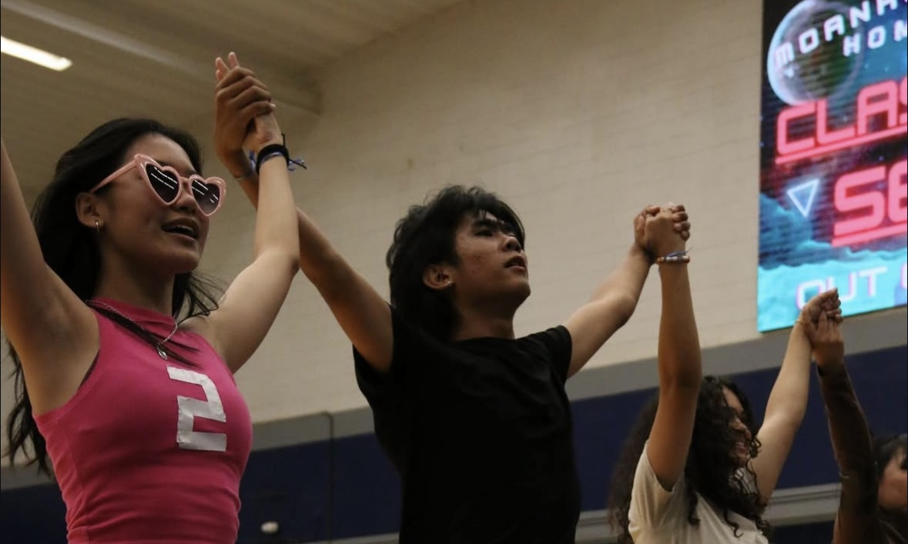

  

In a period of 4 months my fellow homecoming chairs and I worked to put together our performance as the Senior class. We had to follow this years theme and base a 10 minute performance off that. Requirements for this showing included acting, dancing, prop making, backdrop design and more. For our senior year the theme was announced to be 'Out of this World.' We decided to create a storyline that followed bored high school students who ended up hopping on a space shuttle and visiting three music plannets: the girly pop planet, hiphop planet and the Techno planet. Upon visiting each plannet these students are introduced to these alien inhabitants through musical dance routines. At the end they finally make it back to their home planet and come to a resolution. 

For this project, I was a co-chair for the dance comittee and was the main choreographer for the pop planets dance routine. Some of my responsibilities involved curating a music-mix, costume design, running and scheduling rehersals, encouraging fellow class students to participate, and teaching choreography. Other comittees I was apart of included the backdrop design, prop making, and parade comittees. I helped to draw, paint, and box cut cardboard to bring our story to life. Most of us students spent our whole summer commited to ensuring that we put our best foot forward by coming into school every weekday and spending on average 3-4 hours either rehersing choreography or constructing our props.

Prior to this year, I had acted as co-chair for the homecoming floorshow dance comittee since I was a sophomore. Being involved so closely with the other homecoming chairs taught me how to communicate with a large group and lead others under a collective goal. I learned the importance of puncuality and staying on a set schedule and community through spending so much time together week after week. 
