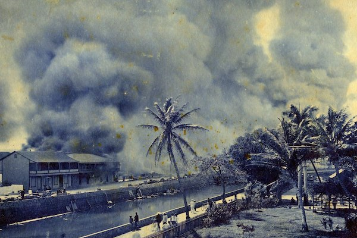

  
  

This project was for my English class which I took in my Fall 2024 semester. We were tasked to pick a place that we felt connected to and tell its story. As an Asian-American I frequented Chinatown while growing up in Oahu. As I was thinking about places that I could talk about I started to wonder why I knew so little about this markets background. In the state of Hawaii its obvious why we were taught modules of Hawaiian history in school multiple times throughout the years, yet I do not recall learning as much about a town that has such a rich history as well. For this assignment I decided to uncover the often overlooked story of Honolulus Chinatown and explore how understanding its journey shapes the way people perceive the area. 

In this class we were required to write a 4 page essay on our chosen topics, conduct interviews, research, and prepare a 10 minute class presentation on our progress before submision. We were responsible for finding scholarly articles as well. As a class we were all given about 4 weeks to work on this project. We would often meet with other students during class to give and receive feedback on our materials. This was an assignment that we were meant to work on as individuals so we were still in charge of doing our own work while we were able to receive peer response. 

This was my first time preparing a presentation that had to be so long. I wasn't used to the idea of having to speak alone about my research project in front of all my peers and my professor. I was nervous, but when I was finally up there I realized it wasn't so bad. I realized that although I was still anxious up until the moment I was speaking in front of everyone, all the practice I had done before that moment really helped prepare me. Through this project I was able to learn the backstory of Honolulus Chinatown and gain a new perspective on a place that I hadn't thought much of before then.

Find my Github repositry holding my essay and powerpoint presentation here: [CLICK HERE](https://github.com/Miley-Chun/Narrative-on-Honolulus-Chinatown)
