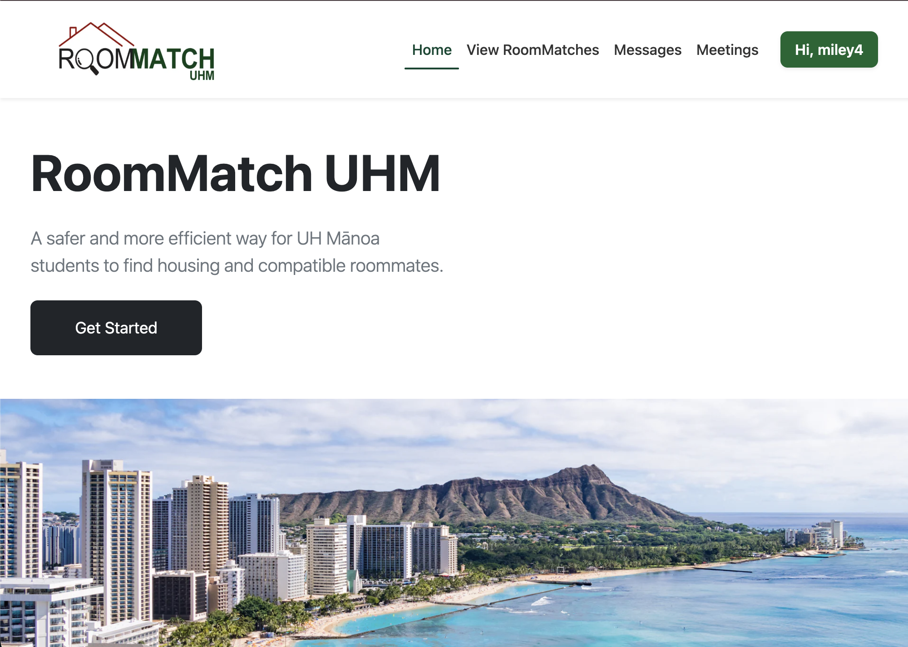

  

## Our Objective
RoomMatch UHM is a full-stack web application that I helped develope for my ICS 314 final project. My team and I worked on both front-end and back-end components, allowing it to function dynamically from user interaction to data processing and storage. RoomMatch UHM is a student-focused housing compatibility platform designed to connect University of Hawaiʻi at Mānoa students seeking roommates or housing opportunities. Our goals were to match UH students with compatible roommates and build a trusted community-based housing network.

## Project Overview
With RoomMatch UHM once the user creates a login and verifies that they are a UH student through our UH email verification, they are able to explore the applications functions which include:

-Create/Edit Profile with Lifestyle Preferences
-Private Messaging
-Schedule Calendar Meeting
-Browse Roommate Listings
-Match with compatible profiles based on profile responses

## Technologies Used
RoomMatch UHM was built off the Next.js application template which provided a solid framework. From base we developed our website on VSCode in conjunction with Github to control our indivdual progress through issue-driven project management and pull request reviews. Neon Postgres was used as our database to hold data such as user profiles, compatibility information, messages, and meetings. Prisma ORM was used for schema modeling and migrations.

## My Contributions
I worked in both frontend and backend development, primarliy focused on data and functionality relating to the users profile. I created the components for the create and edit profile forms, allowing the user to specify their lifestyle preferences and upload a image from their devices downloads. I was in charge of routing the image data correctly from its file form into 64-byte to store into the database as well as the conversion from byte to file. In addition, I contributed to database schema by defining the model for Profiles. I built the browse listings user interface where users can view profiles made by other UH students on the app. For this page I designed the filters to promote efficiency in finding a compatable roommate. 

## What I Learned 
Through developing RoomMatch UHM, I gained a deeper understanding of how full-stack applications function as an integrated system rather than as isolated front-end and back-end components. I strengthened my knowledge of database design by contributing to the Prisma schema and learning how structured data models support features such as profile matching, messaging, and scheduling. Managing user profile images also taught me how to handle non-text data efficiently, including converting files into a format suitable for database storage and rendering them correctly back to the user.

[See More Here](https://roommatch-uhm.github.io/)
